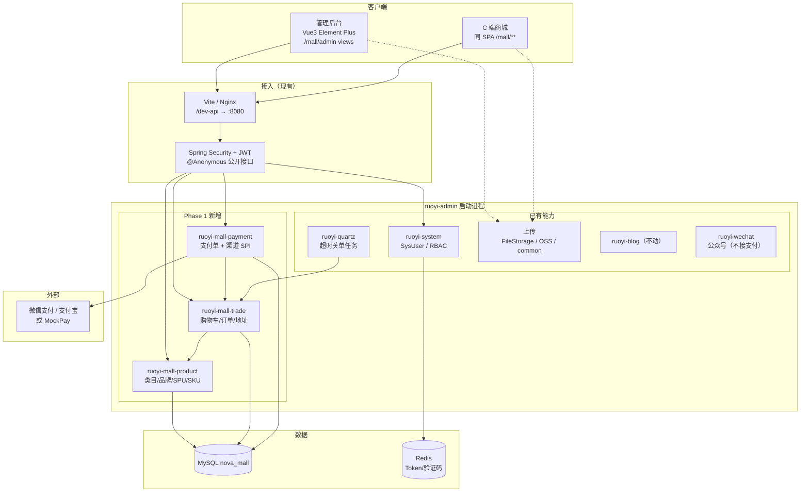
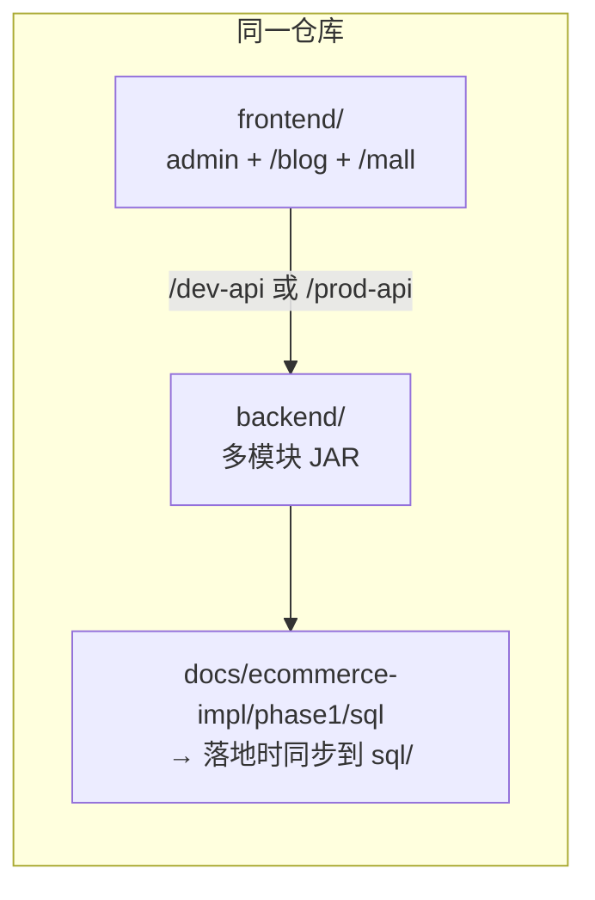
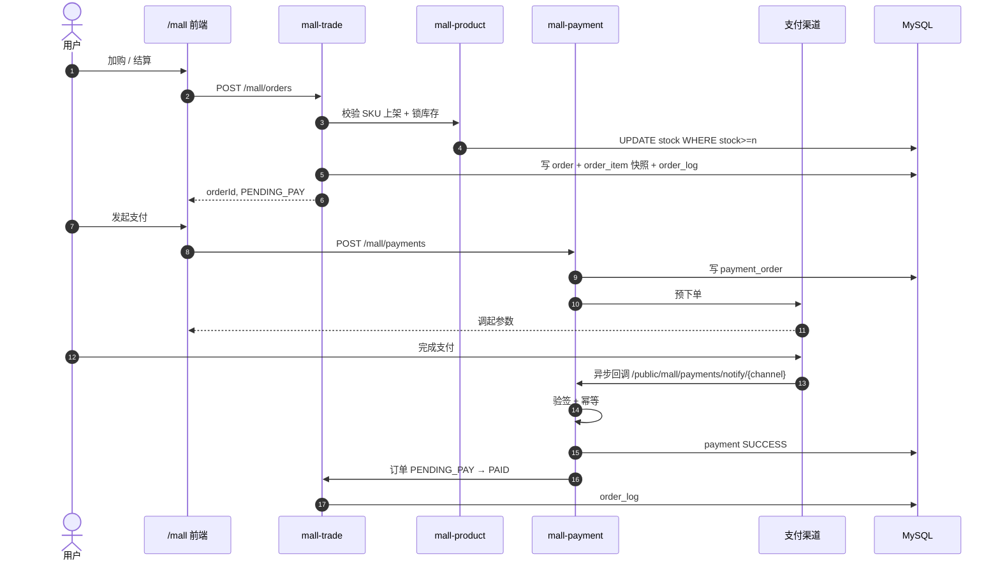
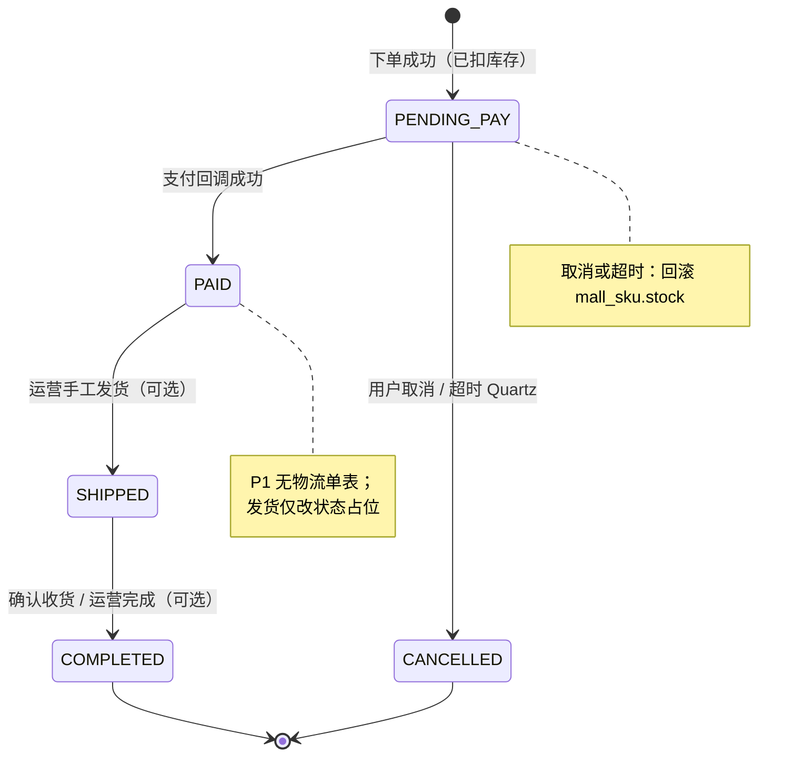
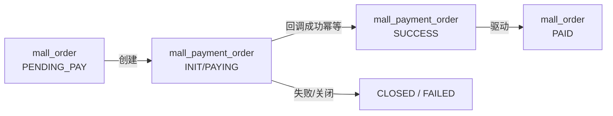
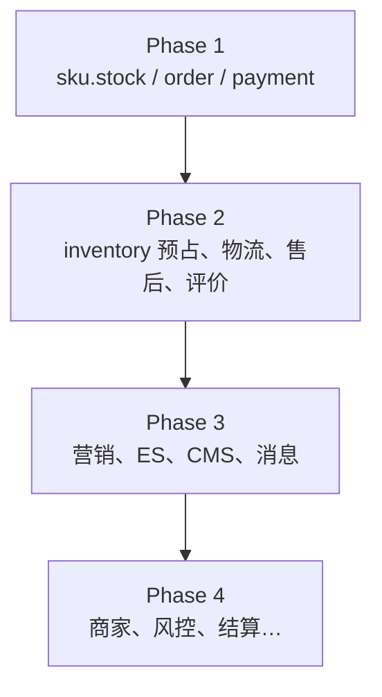

# Phase 1 — 架构图

> 图均为 Mermaid，可在 GitHub / IDE 预览。实现时以本图为边界；超出范围请先改总览与任务拆分。

## 1. 逻辑架构（模块化单体）

## 2. 部署与工程边界

要点：

- C 端与后台仍是**一个前端工程**，路由分区，不新建独立商城仓库（P1）。
- 支付逻辑只在 `ruoyi-mall-payment`，**不**写入 `ruoyi-wechat`。
- 库存 P1 仅为 `mall_sku.stock` 条件更新，无独立库存服务。

## 3. C 端下单支付主链路

## 4. 订单状态机（P1）

## 5. 支付单状态与订单关系

规则：

- 一笔业务订单可对应多次支付尝试（多次 `pay_no`），但**仅一笔**可成功入账。
- 回调金额必须等于订单 `pay_amount`。

## 6. API 分区（示意）

| 分区 | 前缀示例 | 鉴权 |
|---|---|---|
| 公开浏览 | `/public/mall/spus` | `@Anonymous` |
| C 端登录 | `/mall/cart`、`/mall/orders`、`/mall/address`、`/mall/payments` | JWT（SysUser） |
| 支付回调 | `/public/mall/payments/notify/{channel}` | 匿名 + 渠道验签 |
| 运营后台 | `/mall/category`、`/mall/spu`、`/mall/admin/orders` | JWT + `mall:*` 权限 |

## 7. 与后续 Phase 的扩展点

P1 表设计已预留：`order` 状态枚举可扩展；`payment` 与订单解耦便于后续退款单；SKU `stock` 在 P2 可降级为展示缓存或改为由库存中心回写。
