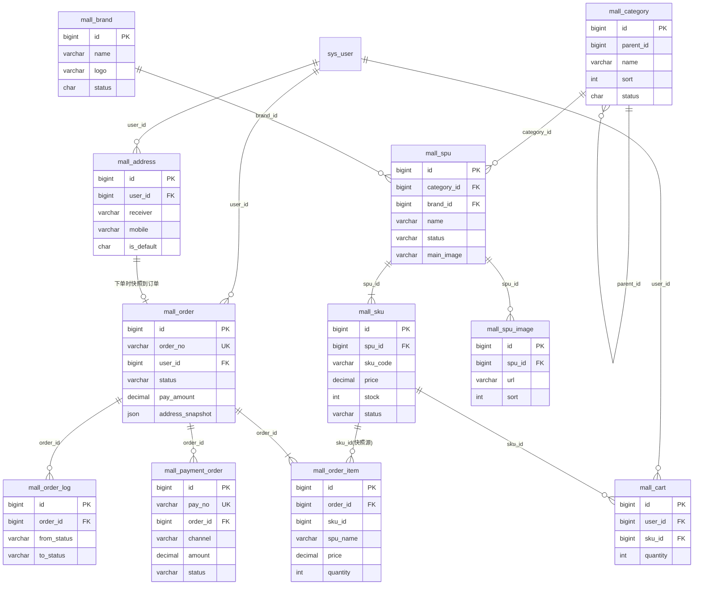
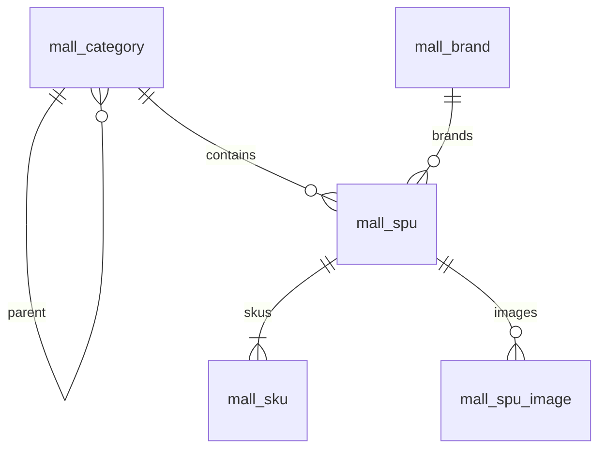
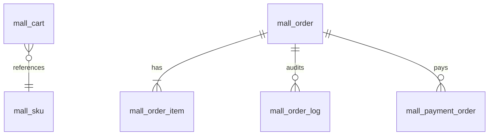

# Phase 1 — E-R 图

库：`nova_mall`。C 端用户默认复用 `sys_user`（方案 A），本图用虚线关联表示，**不新建** `mall_member`。

## 1. 全貌 E-R

## 2. 商品域（放大）

关系说明：

| 关系 | 基数 | 说明 |
|---|---|---|
| category → category | 1:N | 树形类目，`parent_id=0` 为根 |
| category → spu | 1:N | SPU 挂一个类目 |
| brand → spu | 1:N | 品牌可空 |
| spu → sku | 1:N | 至少 1 个 SKU 才可上架 |
| spu → image | 1:N | 主图也冗余在 `mall_spu.main_image` |

## 3. 交易 / 支付域（放大）

要点：

- `mall_order_item` **冗余快照**（名称、规格、单价、图），下单后不随 SPU/SKU 变更。
- `mall_order.address_snapshot` JSON 固化收货信息；不依赖地址表行级外键（地址可删）。
- `mall_payment_order.order_id` 逻辑关联订单；渠道侧以 `pay_no` / `channel_trade_no` 对账。

## 4. 枚举约定

| 字段 | 取值 |
|---|---|
| `mall_spu.status` | `DRAFT` / `ON` / `OFF` |
| `mall_sku.status` | `0` 启用 / `1` 停用（与若依 status 习惯一致，见 DDL） |
| `mall_order.status` | `PENDING_PAY` / `PAID` / `SHIPPED` / `COMPLETED` / `CANCELLED` |
| `mall_payment_order.status` | `INIT` / `PAYING` / `SUCCESS` / `FAILED` / `CLOSED` |
| `mall_payment_order.channel` | `WECHAT` / `ALIPAY` / `MOCK` |

## 5. Phase 2+ 预留（本阶段不建表）

| 未来表 | Phase | 与 P1 接点 |
|---|---|---|
| `mall_warehouse` / `mall_inventory` / `mall_stock_lock` | 2 | 替代/增强 `mall_sku.stock` |
| `mall_shipment` | 2 | `PAID → SHIPPED` 时写物流单 |
| `mall_aftersale` / `mall_refund_order` | 2 | 挂 `order_id` / `pay_no` |
| `mall_review` | 2 | 挂 `sku_id` / `order_item_id` |
| `mall_coupon*` | 3 | 结算改价前介入 |
