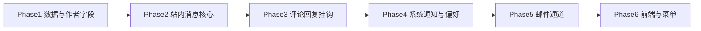

# 通知系统 Implementation Plan

> **For agentic workers:** REQUIRED SUB-SKILL: Use superpowers:subagent-driven-development (recommended) or superpowers:executing-plans to implement this plan task-by-task. Steps use checkbox (`- [ ]`) syntax for tracking.

**Goal:** 在 Ai-Blog-Web 中实现面向登录用户的业务通知能力，覆盖评论通知、回复通知、系统通知；支持站内消息与可选邮件通道，并与现有评论审核流程集成。

**Architecture:** 新增 `blog_user_notification` 用户消息表（与 RuoYi 全局 `sys_notice` 公告分离）；评论/回复在「评论变为已通过」时由 `BlogNotificationService` 统一落库；邮件通过 Spring Mail 异步发送，失败写入 `blog_email_outbox` 供 Quartz/重试任务补偿；前端在现有铃铛 `HeaderNotice` 上增加 Tab（公告 | 我的消息），并提供消息中心页与用户偏好设置。

**Tech Stack:** Java 17、Spring Boot 3.5、MyBatis-Plus、Redis、Vue3 + Element Plus、Spring Mail、RuoYi 权限与 `sys_config`

---

## 0. 现状与边界

| 已有能力 | 说明 |
|---------|------|
| 评论 CRUD / 回复 / 审核 | `BlogCommentServiceImpl`、`AiCommentModerationServiceImpl` |
| 管理端公告 | `sys_notice` + `HeaderNotice`（全员广播，非个人消息） |
| SSE | 仅 AI 聊天流，**不用于通知推送（V1 采用轮询）** |

| 缺口 | 本计划处理 |
|------|-----------|
| `blog_article` 无作者字段 | 增加 `author_user_id`，保存文章时写入当前登录用户 |
| 无用户级通知表 | 新增 `blog_user_notification` 等 |
| 无邮件依赖 | `ruoyi-blog` 引入 `spring-boot-starter-mail` |

**与 `sys_notice` 的关系：** 保留现有「通知公告」不变；个人业务通知走 `/blog/notification/*`，UI 合并展示但数据源分离。

---

## 1. 通知类型与触发规则

```java
public enum BlogNotificationType {
    COMMENT,   // 文章收到新评论（顶级）
    REPLY,     // 评论被回复
    SYSTEM     // 系统/运营消息
}
```

| 类型 | 触发时机 | 接收人 | 不通知条件 |
|------|---------|--------|-----------|
| COMMENT | 评论 `status` 变为 `1`（已通过）且 `parent_id IS NULL` | 文章 `author_user_id` | 评论者本人；文章无作者；匿名作者 |
| REPLY | 回复 `status` 变为 `1` 且 `parent_id IS NOT NULL` | 父评论 `user_id` | 回复者本人；父评论无 `user_id`（匿名父评仅可走邮件扩展，V1 跳过） |
| SYSTEM | 管理员调用发送 API 或后台脚本 | 指定用户或全部启用用户 | — |

**关键：** 仅在「审核通过」时发通知（含：关闭先审后发直接通过、AI 自动通过、管理员 `audit` 通过），不在 `insert` 且仍为待审时发送。

**集成点（3 处）：**

1. `BlogCommentServiceImpl.buildComment` — 若初始 `status == APPROVED`，`afterCommit` 派发
2. `AiCommentModerationServiceImpl.applyResult` — 更新为 `APPROVED` 后派发
3. `BlogCommentServiceImpl.audit` — 批量审核通过时派发

---

## 2. 数据库设计

**文件：** `sql/blog_notification_schema.sql`

```sql
-- 文章作者（前置迁移）
ALTER TABLE blog_article
  ADD COLUMN author_user_id bigint DEFAULT NULL COMMENT '作者用户ID' AFTER category_id,
  ADD KEY idx_author_user_id (author_user_id);

-- 用户站内通知
CREATE TABLE blog_user_notification (
  id bigint NOT NULL AUTO_INCREMENT,
  user_id bigint NOT NULL COMMENT '接收人',
  type varchar(20) NOT NULL COMMENT 'COMMENT/REPLY/SYSTEM',
  title varchar(200) NOT NULL,
  content varchar(1000) NOT NULL,
  link_url varchar(500) DEFAULT NULL COMMENT '跳转链接，如 /blog/detail/1#comment-2',
  biz_type varchar(30) DEFAULT NULL COMMENT 'article/comment',
  biz_id bigint DEFAULT NULL,
  is_read tinyint NOT NULL DEFAULT 0,
  read_time datetime DEFAULT NULL,
  create_time datetime NOT NULL DEFAULT CURRENT_TIMESTAMP,
  PRIMARY KEY (id),
  KEY idx_user_read_time (user_id, is_read, create_time)
) ENGINE=InnoDB DEFAULT CHARSET=utf8mb4 COMMENT='用户站内通知';

-- 通知偏好
CREATE TABLE blog_notification_preference (
  user_id bigint NOT NULL,
  enable_in_app tinyint NOT NULL DEFAULT 1,
  enable_email tinyint NOT NULL DEFAULT 1,
  enable_comment tinyint NOT NULL DEFAULT 1,
  enable_reply tinyint NOT NULL DEFAULT 1,
  enable_system tinyint NOT NULL DEFAULT 1,
  update_time datetime DEFAULT CURRENT_TIMESTAMP ON UPDATE CURRENT_TIMESTAMP,
  PRIMARY KEY (user_id)
) ENGINE=InnoDB DEFAULT CHARSET=utf8mb4 COMMENT='通知偏好';

-- 邮件发件队列（失败重试）
CREATE TABLE blog_email_outbox (
  id bigint NOT NULL AUTO_INCREMENT,
  user_id bigint DEFAULT NULL,
  to_email varchar(128) NOT NULL,
  subject varchar(200) NOT NULL,
  body text NOT NULL,
  status tinyint NOT NULL DEFAULT 0 COMMENT '0待发送 1成功 2失败',
  retry_count int NOT NULL DEFAULT 0,
  error_message varchar(500) DEFAULT NULL,
  create_time datetime NOT NULL DEFAULT CURRENT_TIMESTAMP,
  sent_time datetime DEFAULT NULL,
  PRIMARY KEY (id),
  KEY idx_status_time (status, create_time)
) ENGINE=InnoDB DEFAULT CHARSET=utf8mb4;
```

**sys_config 种子：**

| config_key | 默认值 | 说明 |
|------------|--------|------|
| `blog.notification.enabled` | `true` | 总开关 |
| `blog.notification.email.enabled` | `false` | 邮件总开关（生产再开） |
| `blog.notification.poll.intervalSeconds` | `60` | 前端轮询间隔 |

**菜单（挂博客 2030）：** `消息中心`（C）、`系统通知发送`（C，仅 admin）、按钮权限 `blog:notification:list`、`blog:notification:send`

---

## 3. 后端文件结构

| 路径 | 职责 |
|------|------|
| `domain/BlogUserNotification.java` | 实体 |
| `domain/BlogNotificationPreference.java` | 偏好实体 |
| `domain/BlogEmailOutbox.java` | 邮件队列 |
| `enums/BlogNotificationType.java` | 类型枚举 |
| `mapper/BlogUserNotificationMapper.java` | MP Mapper |
| `service/BlogNotificationService.java` | 创建/查询/已读 |
| `service/impl/BlogNotificationServiceImpl.java` | 实现 + 去重 |
| `service/BlogNotificationDispatcher.java` | 编排 in-app + email |
| `service/impl/BlogEmailServiceImpl.java` | Spring Mail 发送 |
| `event/CommentApprovedEvent.java` | 领域事件（commentId） |
| `listener/CommentApprovedNotificationListener.java` | `@TransactionalEventListener(AFTER_COMMIT)` |
| `controller/BlogNotificationController.java` | REST |
| `controller/BlogNotificationAdminController.java` | 系统通知群发 |
| `dto/NotificationPageQuery.java` | 分页查询 |
| `dto/SystemNotificationSendRequest.java` | 群发 DTO |
| `vo/NotificationVO.java` | 返回 VO |

**依赖：** `backend/ruoyi-blog/pom.xml` 增加：

```xml
<dependency>
  <groupId>org.springframework.boot</groupId>
  <artifactId>spring-boot-starter-mail</artifactId>
</dependency>
```

**配置：** `application.yml` / `application-druid.yml` 示例：

```yaml
spring:
  mail:
    host: ${MAIL_HOST:smtp.example.com}
    port: ${MAIL_PORT:465}
    username: ${MAIL_USERNAME:}
    password: ${MAIL_PASSWORD:}
    properties:
      mail.smtp.auth: true
      mail.smtp.ssl.enable: true
blog:
  notification:
    from: ${MAIL_FROM:noreply@example.com}
    site-name: Ai-Blog
    public-base-url: ${PUBLIC_BASE_URL:http://localhost}
```

---

## 4. 核心服务接口（实现参考）

```java
public interface BlogNotificationService {
    void onCommentApproved(Long commentId);
    Page<NotificationVO> page(Long userId, NotificationPageQuery query);
    long countUnread(Long userId);
    void markRead(Long userId, Long id);
    void markReadAll(Long userId);
    BlogNotificationPreference getPreference(Long userId);
    void updatePreference(Long userId, BlogNotificationPreference pref);
    void sendSystemNotification(SystemNotificationSendRequest request);
}
```

**`onCommentApproved` 伪逻辑：**

```java
BlogComment c = commentMapper.selectById(commentId);
if (c == null || c.getStatus() != STATUS_APPROVED) return;
if (c.getParentId() == null) {
  BlogArticle a = articleMapper.selectById(c.getArticleId());
  Long recipient = a.getAuthorUserId();
  if (recipient == null || Objects.equals(recipient, c.getUserId())) return;
  dispatch(recipient, COMMENT, buildCommentTitle(a, c), link(a, c), "article", a.getId());
} else {
  BlogComment parent = commentMapper.selectById(c.getParentId());
  if (parent.getUserId() == null || Objects.equals(parent.getUserId(), c.getUserId())) return;
  dispatch(parent.getUserId(), REPLY, buildReplyTitle(c), linkArticle(c), "comment", c.getId());
}
```

**去重（可选 V1）：** 同一 `user_id + type + biz_id` 在 5 分钟内仅保留一条，防止重复审核触发。

---

## 5. 文章作者字段改造

**文件：**

- Modify: `sql/blog_schema.sql`（新库）+ 独立迁移 `sql/blog_notification_schema.sql`
- Modify: `domain/BlogArticle.java` — 增加 `authorUserId`
- Modify: `service/impl/BlogArticleServiceImpl.java` — `save()` 时：
  - 新建：`SecurityUtils.getUserId()` 写入 `authorUserId`
  - 更新：不覆盖已有 `authorUserId`（除非为空则补写）
- Modify: `service/impl/AiWriteArticlePersistenceImpl.java`（AI 写文章路径）— 同样写入作者

**历史数据：** `UPDATE blog_article SET author_user_id = 1 WHERE author_user_id IS NULL;`（或按 `create_by` 业务规则）

---

## 6. 评论模块挂钩

### Task A: 发布领域事件

**Files:**

- Create: `event/CommentApprovedEvent.java`
- Modify: `BlogCommentServiceImpl.java` — 审核通过、直接通过时 `publishEvent`
- Modify: `AiCommentModerationServiceImpl.java` — `applyResult` 设为 APPROVED 后 `publishEvent`

```java
@Data
@AllArgsConstructor
public class CommentApprovedEvent {
    private final Long commentId;
}
```

```java
// BlogCommentServiceImpl.audit 循环内
if (Objects.equals(request.getStatus(), BlogCommentConstants.STATUS_APPROVED)) {
    applicationEventPublisher.publishEvent(new CommentApprovedEvent(id));
}
```

### Task B: 监听器调用通知服务

**Files:**

- Create: `listener/CommentApprovedNotificationListener.java`

```java
@Component
@RequiredArgsConstructor
public class CommentApprovedNotificationListener {
    private final BlogNotificationService notificationService;

    @TransactionalEventListener(phase = TransactionPhase.AFTER_COMMIT)
    public void onApproved(CommentApprovedEvent event) {
        notificationService.onCommentApproved(event.getCommentId());
    }
}
```

- [ ] 本地验证：发评论 → 审核通过 → `blog_user_notification` 有记录

---

## 7. 邮件通道

### Task C: Email 服务

**Files:**

- Create: `BlogEmailService.java` / `BlogEmailServiceImpl.java`
- Modify: `BlogNotificationDispatcher.java` — `enable_email` 且用户 `sys_user.email` 非空时异步发信

```java
@Async
public void sendAsync(Long userId, String to, String subject, String htmlBody) {
    if (!configService.emailEnabled()) return;
    try {
        mailSender.send(buildMimeMessage(to, subject, htmlBody));
    } catch (Exception ex) {
        outboxMapper.insert(failedRow(...));
    }
}
```

邮件模板（简单 HTML）：标题、摘要、按钮「查看详情」链到 `public-base-url + link_url`。

- [ ] 使用 MailHog / 企业 SMTP 在开发环境验证一封 COMMENT 邮件

---

## 8. REST API

| 方法 | 路径 | 权限 | 说明 |
|------|------|------|------|
| GET | `/blog/notification/list` | 登录 | 分页，支持 `type`、`isRead` |
| GET | `/blog/notification/unread-count` | 登录 | 未读数（Redis 缓存可选） |
| POST | `/blog/notification/{id}/read` | 登录 | 单条已读 |
| POST | `/blog/notification/read-all` | 登录 | 全部已读 |
| GET | `/blog/notification/preference` | 登录 | 获取偏好 |
| PUT | `/blog/notification/preference` | 登录 | 更新偏好 |
| POST | `/blog/notification/admin/send` | `blog:notification:send` | 系统通知 |

**响应示例 `NotificationVO`：**

```json
{
  "id": 1,
  "type": "REPLY",
  "title": "张三 回复了你的评论",
  "content": "说得对，我也遇到过…",
  "linkUrl": "/blog/detail/12#comment-99",
  "isRead": false,
  "createTime": "2026-05-29 10:00:00"
}
```

---

## 9. 前端改造

### Task D: API 层

**Files:**

- Create: `frontend/src/api/blog/notification.js`

```javascript
import request from '@/utils/request'

export function listNotifications(query) {
  return request({ url: '/blog/notification/list', method: 'get', params: query })
}
export function getUnreadCount() {
  return request({ url: '/blog/notification/unread-count', method: 'get' })
}
export function markNotificationRead(id) {
  return request({ url: `/blog/notification/${id}/read`, method: 'post' })
}
export function markNotificationReadAll() {
  return request({ url: '/blog/notification/read-all', method: 'post' })
}
export function getNotificationPreference() {
  return request({ url: '/blog/notification/preference', method: 'get' })
}
export function updateNotificationPreference(data) {
  return request({ url: '/blog/notification/preference', method: 'put', data })
}
```

### Task E: 铃铛组件 Tab 化

**Files:**

- Modify: `frontend/src/layout/components/HeaderNotice/index.vue`
  - Tab1：通知公告（现有 `listNoticeTop`）
  - Tab2：我的消息（`listNotifications` + `unreadCount` 合并角标）
- Create: `frontend/src/views/blog/notification/index.vue` — 消息中心（全部/未读、类型筛选）
- Modify: `frontend/src/views/system/user/profile/index.vue` 或独立「通知设置」— 偏好开关

### Task F: 管理端系统通知

**Files:**

- Create: `frontend/src/views/blog/notification/send.vue` — 标题、内容、接收范围（全员 / 指定用户）

### Task G: 公开前台（可选 V1.1）

- 登录用户在 `public/blog/detail.vue` 评论后可提示「有回复将通知您」；未登录仅提示填邮箱（邮件扩展，可后置）

- [ ] 角标：公告未读 + 消息未读 合并显示在铃铛上

---

## 10. 实施阶段（推荐顺序）



| Phase | 交付物 | 可独立验收 |
|-------|--------|-----------|
| 1 | SQL + `author_user_id` + 实体 | 文章保存带作者 |
| 2 | Notification CRUD + API | Postman 查未读/已读 |
| 3 | 评论审核触发 COMMENT/REPLY | 审核后 DB 有记录 |
| 4 | 系统群发 + preference | 管理员发系统消息 |
| 5 | Mail + outbox | 收到测试邮件 |
| 6 | HeaderNotice + 消息中心页 | UI 端到端 |

---

## 11. 测试要点

| 场景 | 预期 |
|------|------|
| A 评论自己的文章 | 无 COMMENT 通知 |
| B 用户 B 评论 A 的文章，待审 | 无通知 |
| B 审核通过 | A 收到 COMMENT |
| C 回复 B 的评论并审核通过 | B 收到 REPLY |
| D 关闭 `enable_comment` | 仅跳过 COMMENT，REPLY 仍受 `enable_reply` 控制 |
| E 关闭邮件总开关 | 仅站内，outbox 无新增 |
| F 系统通知全员 | 所有有偏好用户收到 SYSTEM |

**构建验证：**

```bash
cd backend && mvn -B -DskipTests clean compile -pl ruoyi-admin -am
cd frontend && npm run build:prod
```

---

## 12. 风险与后续扩展

| 风险 | 缓解 |
|------|------|
| 历史文章无作者 | 迁移脚本 + 保存时补写 |
| 邮件进垃圾箱 | 配置 SPF/DKIM；`from` 与域名一致 |
| 高频评论刷通知 | 5 分钟去重 + 偏好关闭 |

**V2 可选：** WebSocket/SSE 实时推送、匿名父评邮件（`guest_email`）、站内信模板管理、移动端推送。

---

## 13. 任务清单（执行勾选）

### Phase 1：数据与作者

- [ ] 编写 `sql/blog_notification_schema.sql` 并更新 README 初始化顺序
- [ ] `BlogArticle` + `BlogArticleServiceImpl.save` 作者字段
- [ ] 历史数据迁移

### Phase 2：站内消息核心

- [ ] 实体 / Mapper / Service / Controller
- [ ] 单元或接口测试：创建、未读数、已读

### Phase 3：评论挂钩

- [ ] `CommentApprovedEvent` + Listener
- [ ] 三处审核通过发布事件
- [ ] 集成测试 COMMENT + REPLY

### Phase 4：系统通知与偏好

- [ ] `sendSystemNotification` + 管理 API
- [ ] `blog_notification_preference` 读写

### Phase 5：邮件

- [ ] `spring-boot-starter-mail` + `BlogEmailService`
- [ ] `blog_email_outbox` + 简单重试 Job（可用 `@Scheduled`）

### Phase 6：前端

- [ ] `api/blog/notification.js`
- [ ] `HeaderNotice` Tab 合并
- [ ] `views/blog/notification/index.vue` + 菜单种子
- [ ] 个人中心通知偏好

---

## Spec 覆盖自检

| 需求 | 对应章节 |
|------|---------|
| 评论通知 | §1 COMMENT、§6 挂钩 |
| 回复通知 | §1 REPLY、§6 挂钩 |
| 系统通知 | §1 SYSTEM、§8 admin API、§9 Task F |
| 邮件通知 | §7、§5 配置 |
| 站内消息 | §2 表、§8 API、§9 UI |

**无 TBD / 占位任务。**
